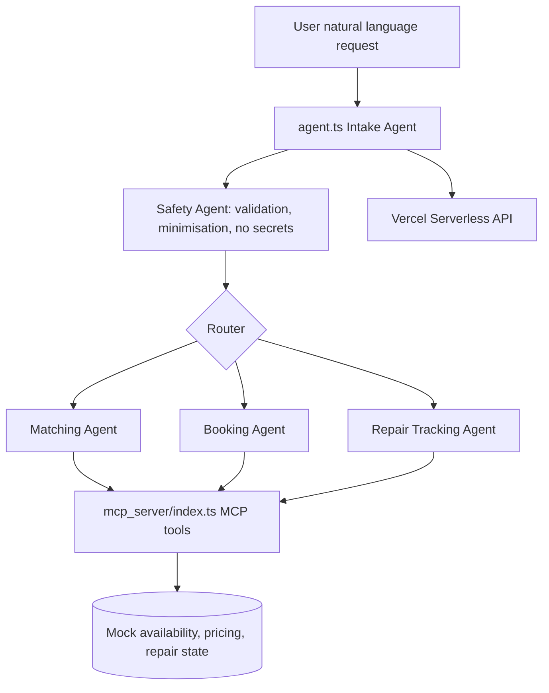
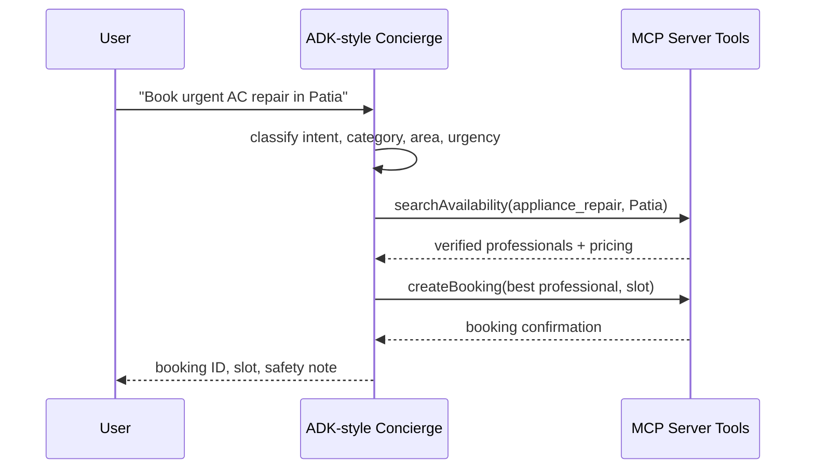

# Local Services Concierge Agent — Kaggle AI Agents Intensive Capstone

A zero-shot, deployable concierge agent for matching residents of **Bhubaneswar, Odisha** with verified local service professionals. The project demonstrates three rubric pillars: an ADK-style multi-agent system, an MCP server exposing trusted operational data, and production deployment on Vercel.

## Quick start

```bash
npm install
npm run check
npm run test:smoke
vercel --prod
```

## API usage

```bash
curl -X POST http://localhost:3000/api/agent \
  -H 'content-type: application/json' \
  -d '{"message":"Book an urgent AC repair in Patia","customerAlias":"demo-user"}'
```

## Architecture





## Agent skills

The agent includes specialized sub-agents documented inline in `agent.ts`:

- **Intake agent** parses service category, Bhubaneswar area, urgency, and tracking IDs.
- **Safety agent** validates request shape, removes unsafe characters, and avoids collecting sensitive information.
- **Matching agent** invokes MCP availability and pricing tools.
- **Booking agent** confirms a slot with a verified professional.
- **Repair tracking agent** retrieves live-like repair state transitions.

## MCP tools

`mcp_server/index.ts` exposes a secure JSON tool layer:

| Tool | Purpose |
| --- | --- |
| `searchAvailability` | Returns verified professionals by service category and area. |
| `quoteService` | Returns inspection fees and typical price bands. |
| `createBooking` | Confirms a booking only for an existing professional and available slot. |
| `trackRepair` | Returns repair state, ETA, and latest update for a tracking ID. |

## Security features

- No API keys, passwords, or external secrets are committed.
- Zod schemas validate all tool inputs.
- Mock databases are read-only except deterministic booking confirmation responses.
- Vercel headers disable content sniffing, referrer leakage, and browser device permissions.
- The safety agent minimizes user text before it is stored in booking summaries.

## Deployment

`vercel.json` keeps Vercel runtime auto-detection enabled, configures the `/api/agent` and `/api/mcp` serverless entrypoints, and rewrites `/` to the agent health/demo endpoint. The build command is `npm run build`, which performs a strict TypeScript check.

